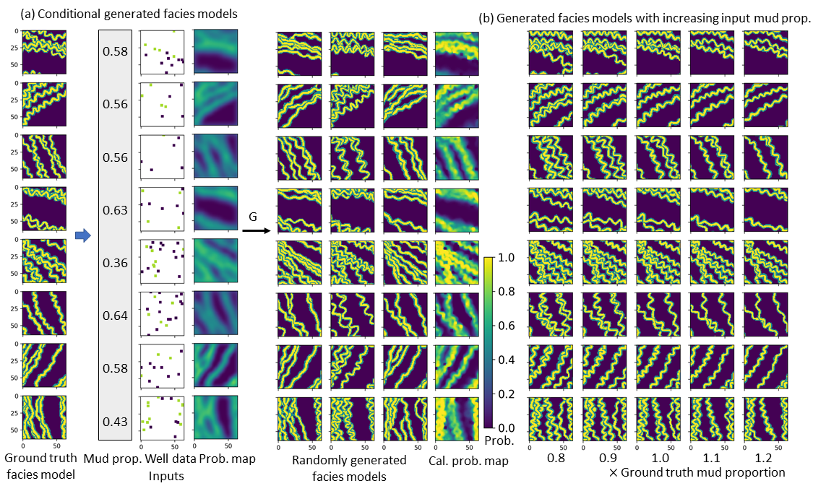
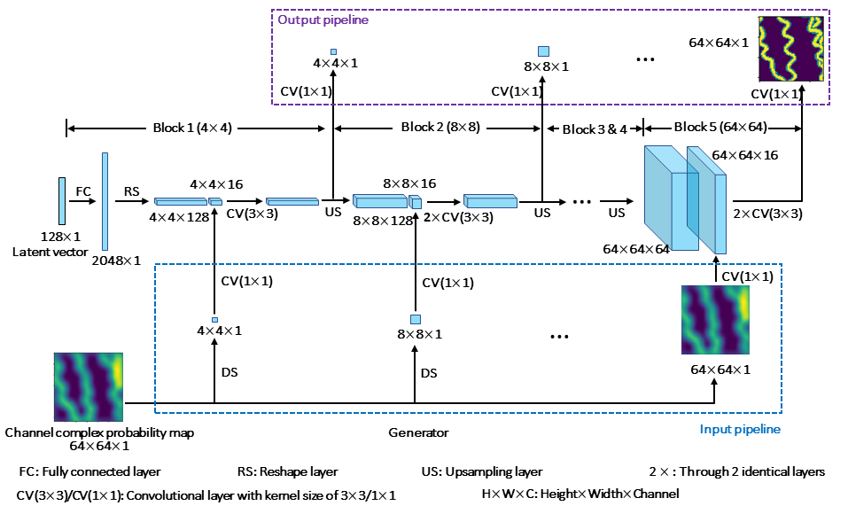

## Bridging the gap between geophysics and geology with improved GANSim
## Also as: Improved GANSim: Geological facies modeling conditioned to probability maps, global features, and well facies data


 
**Picture:** *(a) Pre-trained generator produces facies models conditioned to input mud proportion, well facies data, and geophysics-interpreted probability maps. (b) Generated facies models with increasing input mud proportion values.*

 
**Picture:** *Progressive training workflow of generator conditioned to probability maps.*

This repository contains the official TensorFlow implementation of the following paper:

> **Bridging the Gap Between Geophysics and Geology With Generative Adversarial Networks** <br>
> Suihong Song (CUPB & Stanford), Tapan Mukerji (Stanford), and Jiagen Hou (CUPB)<br>
> CUPB: China University of Petroleum - Beijing

> https://ieeexplore.ieee.org/abstract/document/9399180
>
> **Abstract:** Inverse mapping from geophysics to geology is a difficult problem due to the inherent uncertainty of geophysical data and the spatially heterogeneous patterns (structure) in geology. We describe GANSim, a type of generative adversarial networks (GANs) that discovers the mapping between remotely-sensed geophysical information and geology with realistic patterns, with a specially designed loss function and an input architecture for geophysics-interpreted probability maps. This GANSim is then used to produce realizations of realistic geological facies models conditioned to the probability maps alone or together with well observations and global features. By evaluation, the generated facies models are realistic, diversified, and consistent with all input conditions. We demonstrate that the GAN learns the implicit geological pattern knowledge from training data and the knowledge of conditioning to inputs from human-defined explicit functions. Given the commonality of probability maps, sparse measurements, and global features, GANSim should be applicable to many problems of geosciences.

This study is based on our previous study (GeoModeling_Conditional_ProGAN, see Github https://github.com/SuihongSong/GeoModeling_Conditional_ProGAN). 

For any question, please contact [songsuihong@126.com]<br>


## Resources

Material related to our paper is available via the following links:

- Paper: https://ieeexplore.ieee.org/abstract/document/9399180 or (my research gate) https://www.researchgate.net/profile/Suihong_Song.
- Code: (Github) https://github.com/SuihongSong/GeoModeling_Conditional_to_Probability_maps_plus 
- Training and test datasets: (Zenodo) https://zenodo.org/record/3977852#.X1HazshKhaQ
- Pre-trained GANs: (Zenodo) https://zenodo.org/record/3977852#.X1HazshKhaQ, or (Google Drive) https://drive.google.com/drive/folders/1K3ajEGq-l2ENfXsy2vH4Ko5hM5fRDkLP

## Licenses

All material, including our training dataset, is made available under MIT license. You can **use, redistribute, and adapt** the material for **non-commercial purposes**, as long as you give appropriate credit by **citing our paper** and **indicating any changes** that you've made.

## System requirements

* Both Linux and Windows are supported, but Linux is suggested.
* 64-bit Python 3.6 installation. We recommend Anaconda3 with numpy 1.14.3 or newer.
* TensorFlow 1.10.0 or newer with GPU support. 
* (NOTE: the codes can also be run with TensorFlow2.x environment after adjusting several lines of codes, see 'Codes adjustments for TensorFlow 2')
* One or more high-end NVIDIA GPUs. 
* NVIDIA driver 391.35 or newer, CUDA toolkit 9.0 or newer, cuDNN 7.4.1 or newer.

## Using pre-trained networks

We trained four GANs, conditioned to probability maps only, and conditioning to probability maps, global features (e.g., channel sinuosity, channel width, non-channel mud proportion) and well facies data together. In [Code](./Code/), there are two subfolders: [4-Upload_cond_Probmap](./Code/4-Upload_cond_Probmap/) and [5-Upload_cond_well_globalfeatures_probmap](./Code/5-Upload_cond_well_globalfeatures_probmap/); the former is used for only conditioning to probability maps, and the latter is used for conditioning to probability maps, global features, and well facies data together. All GANs are trained with progressive training method illustrated in our previous paper (see Github repository https://github.com/SuihongSong/GeoModeling_Unconditional_ProGAN).

The pre-trained GANs (including generators) are evaluated in ` Analyses_of_Trained_Generator.ipynb ` (refered to as `*.ipynb` in following) files using Test dataset (Zenodo, https://zenodo.org/record/3977852#.X1JFdMhKjIV, Google Drive, https://drive.google.com/drive/folders/1K3ajEGq-l2ENfXsy2vH4Ko5hM5fRDkLP) regarding the evaluation metrics in paper. Corresponding to the two pre-trained GANs, there are two indepedent evaluation \*.ipynb files: 

(1) only conditioning to probability maps [Analyses_of_Trained_Generator.ipynb](./Code/4-Upload_cond_Probmap/Analyses_of_Trained_Generator.ipynb); 

(2) conditioning to probability maps, global features, and well facies data together [Analyses_of_Trained_Generator.ipynb](./Code/5-Upload_cond_well_globalfeatures_probmap/Analyses_of_Trained_Generator.ipynb)

Before running  \*.ipynb files, please download related code files, corresponding pre-trained networks, and Test dataset, and modify corresponding paths in \*.ipynb files. Readers are welcome to play with other randomly defined input conditioning data in \*.ipynb files. 

Our training and test datasets both include synthesized facies models, corresponding global features, well facies data, and probability maps. Each one facies model corresponds to one pair of global features (mud proportion, channel sinuosity, channel width, and channel orientation), 8 random well facies data, and 8 probability maps with various blurriness. These four categories of data can be extracted as numpy arrays using following code:
```
# Initialize TensorFlow session.
tf.InteractiveSession()

import dataset
# tfrecord_dir='TestData' to fetch test dataset, if tfrecord_dir='TrainingData' to fetch training dataset
# labeltypes: 0 for 'channelorientation', 1 for 'mudproportion', 2 for 'channelwidth', 3 for 'channelsinuosity'
# well_enlarge: if True, well points occupy 4x4 area, otherwise occupy 1x1 area
test_set = dataset.load_dataset(data_dir=data_dir_test, verbose=True, tfrecord_dir='TestData', labeltypes = [1,2,3], well_enlarge = False, shuffle_mb = 0, prefetch_mb = 0)

# labels are from -1 to 1
image_test, label_test = test_set.get_minibatch_imageandlabel_np(3000)  
probimg_test, wellfacies_test = test_set.get_minibatch_probandwell_np(3000*8)
```

`*.ipynb` files can also be run on Colab: 

(1) open `*.ipynb` files in Colab by using Github link: `File` -> `Open notebook` -> `Github` -> enter the corresponding `*.ipynb` Github link. 

(2) in Colab, check tensorflow version by running `%tensorflow_version`, and run `%tensorflow_version 1.x` if the tensorflow has default version of 2.x; also, make sure `GPU` is used in Colab by `Change runtime type` (`Runtime` -> `Change runtime type`).

(3) download all related codes into Colab by running in Colab:
```
!git clone https://github.com/SuihongSong/GeoModeling_Conditional_to_Probability_maps_plus.git
```
(4) download test dataset from my google drive (https://drive.google.com/drive/folders/1K3ajEGq-l2ENfXsy2vH4Ko5hM5fRDkLP) as \*.zip file, by running in Colab:
```
!gdown --id 1LyfefUwcOdfOA6MjcYJTthqvwhT5xj4V  #1Lyf … is the Google Drive id for the file
```
then unzip the downloaded `TestData.zip`, by running in Colab:
```
!unzip /content/TestData.zip
```
(5) download corresponding pre-trained GAN networks, by running in Colab:
```
!gdown --id 1T8JlGAdJbhp__mmub1UUeir-11eYn-CH  #here 1T8J … refers Google Drive ID for pre-trained GAN network conditioning to probability maps, global features and well facies data together as an example; obtain Google Drive ID for other pre-trained the other GAN network and replace it.
```

(6) run following codes in `*.ipynb` files, and play with the pre-trained generators. 


The pre-trained GAN networks are stored as standard pickle files:
```
# pre-trained generator directory path; please replace it with your own path.
network_dir = '/scratch/users/suihong/…/…/'

# replace with downloaded pre-trained generator name.
with open(network_dir + 'network-snapshot-011520.pkl', 'rb') as file:
G, D, Gs = pickle.load(file)
    # G = Instantaneous snapshot of the generator. Mainly useful for resuming a previous training run.
    # D = Instantaneous snapshot of the discriminator. Mainly useful for resuming a previous training run.
    # Gs = Long-term average of the generator. Yields higher-quality results than the instantaneous snapshot.
```

The above code unpickles pre-trained GAN networks to yield 3 instances of networks. To generate facies models, you will want to use `Gs` or `G`. The exact details of the generator and discriminator are defined in [networks.py](./Code/4-Upload_cond_Probmap/networks.py) or [networks.py](./Code/5-Upload_cond_well_globalfeatures_probmap/networks.py) (see ` G_paper `, and ` D_paper `). 

The input of generator contains latent vectors of 128 dimensions, global features, well facies data, or probability maps, depending on which data the generator is conditioned to:

(1) for generator only conditioned to probability maps, the inputs have dimensions of [[N, 128], [N, 4], [N, 1, 64, 64]]. N refers to number of input vectors, 128 is dimension of latent vector. 4 is the dimension of global features, which are not cast away in current version, but the input global features have no controlling effects on outputs, so input global features can be just set as random values. [1, 64, 64] refers to the dimension of input channel complex probability map. 

(2) for generator conditioned to probability maps, global features, and well facies data, the inputs have dimensions of [[N, 128], [N, 1], [N, 2, 64, 64], [N, 1, 64, 64]]. 1 is because we only use 1 type of global feature (mud proportion) as condition; [2, 64, 64] is the dimension of input well facies data in this case. 

## Training dataset

The training dataset (Zenodo, https://zenodo.org/record/3977852#.X1JFdMhKjIV) includes synthesized facies models, corresponding global features, probability maps, and well facies data. Training facies models are stored as multi-resolution TFRecords. Each original facies model (64x64) is downsampled into multiple resolutions (32x32, …, 4x4) and stored in `1r*.tfrecords` files for efficient streaming during training. There is a separate `1r*.tfrecords` file for each resolution. Training probability maps are stored as `*.2probimages.tfrecords`; training well facies data is stored as `*3wellfacies.tfrecords`; training global features are stored as `*4rxx.labels`.


### How to make training data as TFRecords?

(1) In our study, we synthesize training facies models using object-based method in Petrel software, and export them into one file as model properties with `"Gslib"` format. An Gslib format example of the exported file is [Format_example_of_simulated_facies_models_from_Petrel.txt](./Code/Format_example_of_simulated_facies_models_from_Petrel.txt).

First lines of the exported file are like:

>PETREL: Properties
>
>17820 % Number of synthesized facies models
>
>Facies unit1 scale1
>
>Facies unit1 scale1
>
>...
>
>Facies unit1 scale1
>
>% Totally, there are 64x64 lines, corresponding to 64x64 pixels in each facies model; each line has 17820 numbers splitted by space, corresponding to 17820 facies code values of 17820 generated facies realizations at each pixel. 0-background mud faceis, 1-channel sand facies, 2-channel bank facies.
>
>0.000000 0.000000 0.000000 0.000000 0.000000 0.000000 ... 0.000000 1.000000 2.000000
>
>0.000000 1.000000 0.000000 0.000000 0.000000 0.000000 ... 0.000000 0.000000 0.000000
>
>...
>
>0.000000 0.000000 0.000000 0.000000 0.000000 0.000000 ... 0.000000 0.000000 0.000000


(2) This exported file containing synthesized facies models is read in [Preparing_training_and_test_datasets.ipynb](./Code/Preparing_training_and_test_datasets.ipynb). The data in the file is rearranged into `(FaciesModelNumber, 1, 64, 64)`. 

In our study, when synthesizing facies models in Petrel, we only consider orientation of channels varying from 0 to 90 degrees, thus in [Preparing_training_and_test_datasets.ipynb](./Code/Preparing_training_and_test_datasets.ipynb), we further enlarge the facies model dataset by reversing the synthesized facies mdoels vertically whose orientation become from -90 to 0 degrees:
```
allimgs = np.concatenate((partimgs, partimgs[::-1,:,:]),2)
```
Other software, like SGeMS, can also be used to simulate the training facies models, as long as the final generated facies models are arranged into `(FaciesModelNumber, 1, 64, 64)`.

Global features (also called labels) are arranged into `(FaciesModelNumber, GlobalFeaturesNumber)`.

(3) The facies models are then used to simulate probability maps in `3 Generate probability maps` of [Preparing_training_and_test_datasets.ipynb](./Code/Preparing_training_and_test_datasets.ipynb). The probability maps are then used to produce well facies data in `4 Generate well facies` of [Preparing_training_and_test_datasets.ipynb](./Code/Preparing_training_and_test_datasets.ipynb). 

(4) When downsampling training facies models, two methods were proposed currently: `averaging facies codes`, or `remaining the most frequent facies code`. In this paper, here we use the `remaining the most frequent facies code` method. In the near future, we will propose to use a third downsampling method: averaging indicator of each facies. 

```
# used to produce low-D with most frequent facies code
real_img_t = np.expand_dims(real_img, axis = 3)
real_img_t_c = np.concatenate((real_img_t[:, 0::2, 0::2], real_img_t[:, 0::2, 1::2], real_img_t[:, 1::2, 0::2], real_img_t[:, 1::2, 1::2]), axis = 3)                
mode, _ = stats.mode(real_img_t_c, axis = 3)
real_img = np.squeeze(mode, axis = 3)
                
# used to produce low-D with averaging method
#real_img = (real_img[:, 0::2, 0::2] + real_img[:, 0::2, 1::2] + real_img[:, 1::2, 0::2] + real_img[:, 1::2, 1::2]) * 0.25  
```

## Training networks

Once the training dataset and related codes are downloaded, you can train your own facies model generators as follows:

1. Edit [config.py](./Code/4-Upload_cond_Probmap/config.py) or [config.py](./Code/5-Upload_cond_well_globalfeatures_probmap/config.py) to set path `data_dir` (this path points to the folder containing `TrainingData` and `TestData` folders) for the downloaded training data and path for expected results `result_dir`, gpu number. Global feature types are set with following code:
```
labeltypes = [1]  # can include: 0 for 'channelorientation', 1 for 'mudproportion', 2 for 'channelwidth', 3 for 'channelsinuosity'; but the loss for channel orientation has not been designed in loss.py.
# [] for no label conditioning.
```
If using conventional GAN training process (non-progressive training), uncomment the line of code: 
```
#desc += '-nogrowing'; sched.lod_initial_resolution = 64; train.total_kimg = 10000
```
Set if the input well facies data is enlarged (each well facies data occupies 4x4 pixels) or unenlarged (each well facies data only occupies 1x1 pixel), by uncommenting or commenting following line of code:
```
dataset.well_enlarge = True; desc += '-Enlarg';  # uncomment this line to let the dataset output enlarged well facies data; comment to make it unenlarged.
```

2. Edit [train.py](./Code/4-Upload_cond_Probmap/train.py) or [train.py](./Code/5-Upload_cond_well_globalfeatures_probmap/train.py) to set detailed parameters of training, such as parameters in `class TrainingSchedule` and `def train_progressive_gan`.

3. Set default path as the directory path of downloaded code files, and run the training script with `python train.py`. Or, edit path in [RunCode.py](./Code/4-Upload_cond_Probmap/RunCode.ipynb) or [RunCode.py](./Code/5-Upload_cond_well_globalfeatures_probmap/RunCode.ipynb), and run `% run train.py` in `RunCode.py` files with Jupyter notebook.

## Assessment of the trained generator

Each of the two pre-trained generators are evaluated using Test dataset (Zenodo, https://zenodo.org/record/3977852#.X1JFdMhKjIV) in `Analyses_of_Trained_Generator.ipynb ` files:

(1) for generator only conditioned to probability maps [Analyses_of_Trained_Generator.ipynb](./Code/4-Upload_cond_Probmap/Analyses_of_Trained_Generator.ipynb); 

(2) for generator conditioned to probability maps, global features, and well facies data [Analyses_of_Trained_Generator.ipynb](./Code/5-Upload_cond_well_globalfeatures_probmap/Analyses_of_Trained_Generator.ipynb).

Detailed steps are illustrated inside these `*.ipynb` files. How to run them is also explained in previous section ` Using pre-trained networks `.

Please note that the exact results may vary from run to run due to the non-deterministic nature of TensorFlow.

## License
Most code files of this study are derived from the original Progressive GANs work (https://github.com/tkarras/progressive_growing_of_gans), but we have largely amended the original codes, especially networks.py, loss.py, dataset.py, and train.py. The original Progressive GANs codes are under license of Attribution-NonCommercial 4.0 International (https://creativecommons.org/licenses/by-nc/4.0/). Other materials produced by us (e.g., the trained models and the parts of codes we have added or adjusted) are under MIT license. 

## Acknowledgements

Code for this project is improved from the original code of Progressive GANs (https://github.com/tkarras/progressive_growing_of_gans). We thank the authors for their great job.
